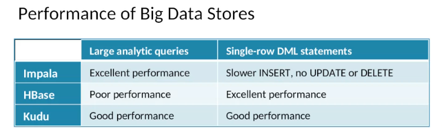
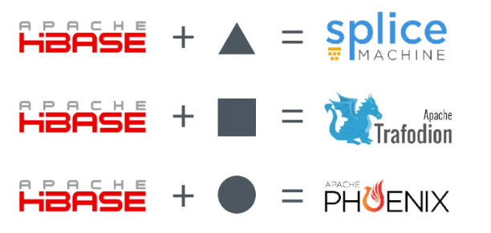

# Big Data, Databases and SQL

## Strength and Limitaions of RDBMS 

### Strength of RDBMS

### Limitations of RDBMS in the Age of Big Data 

limited capability of analyzing unstructured and unstructured data

## Big Databases, Big Data Stores, and SQL 

- Analytic systems (data warehouses)

- Operational systems 
  - Non-transactional, unstructured and semi-structured   
  - Non-transactional, structured
  - ACID-compliant RDBMSs
  
- Search engines 

### Big Data Analytic Databases (Data Warehouses)

good for deep analysis

Apache Impala, Apache Hive, Apache Drill, presto

Oracle, Teradata

### NoSQL Databases 

good for carefully focused operational applications 

provide simple DML and query commands and they physically organize records to a specific lookup key. 

- Apache HBase: binary array

- cassandra: various data types

- mongoDB, Couchbase: JSON-like structure 

NoSQL databases perform well if we only have a few defined patterns for accessing data. 

### Non-transactional databases

Some database systems lies in the middle of NoSQL databases and traditional RDBMS systems, they are called non-transactional system, for structured tables.

Apache kudu

- table structure 

- enforce primary key constraints, but not foreign key constraints 

- allow single DML on individual rows 

- does not allow multi-row ACID-compliant transactions

### Big Data ACID-Compliant RDBMSs

Based on Apache HBase, add relational data structure 

### Search engines 

not exactly focused on operations or analysis, but specialize in quick and flexible look-ups. 

Solr, elasticsearch

## SQL for Big Data Analysis 

difficulties (expanding ACID-compliant system at larger scaled) 

- distributed transactions 

- data variety (limitations of schema on write)

features kept 

- `SELECT` systems, including multi-table `SELECT`s

- seeing data as tables with column names 

- DDL and DCL

features dropped, no transactions means no 

- constraints on unique columns 

- primary key constraints and foreign key constraints

- synchronized indexes (need to rebuild)

- triggers and stored procedures  

- `UPDATE` and `DELETE` statements for some (cannot update file in place)

features add 

- table partitions 

- support for many file formats 
  - csv, tsv and other deliminated files, json, XML
  - binary file format: Apache AVRO and Apache Parquet

- complex data types 
  - `ARRAY`: list column 
  - `MAP`: nested tibble 
  - `STRUCT`

